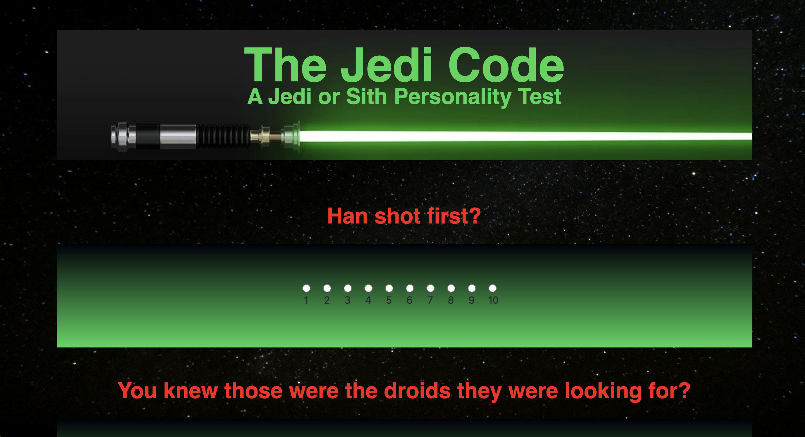

# The Jedi Code

The Jedi code is an interactive quiz game that will gather information about you based on your answer choices and will determine if you resemble a sith or a jedi most.

## Motivation

Our motivation when building this application was to create an engaging questionaire for people interested in Star Wars. Our group focused on building a theme similar to the films to make fans excited. 

## Installation 

To install all necessary dependencies, open the terminal inside youre root folder and run 'npm i'. 

## Getting Started
Run 'npm start' inside your root terminal.

To participate, give your best answers in the questionaire then click 'submit' to get your results

## Technologies

* [HTML](https://developer.mozilla.org/en-US/docs/Web/HTML)
* [CSS](https://developer.mozilla.org/en-US/docs/Web/CSS)
* [NodeJs](https://developer.mozilla.org/en-US/docs/Glossary/Node.js)
* [ReactJs](https://developer.mozilla.org/en-US/docs/Learn/Tools_and_testing/Client-side_JavaScript_frameworks/React_getting_started)
* [MySQL](https://www.siteground.com/tutorials/php-mysql/mysql/)
* [Javascript](https://developer.mozilla.org/en-US/docs/Web/JavaScript)

## Deployed Link

* [See Live Site](https://fanuelproject2.herokuapp.com/)

## Authors

Fanuel Alem, Ganesh nimavat, HusamAhalim, Vanessa Emerick,

- [Link to Portfolio Site](https://fanuel-react-app.herokuapp.com/)
- [Link to Github](https://github.com/fanuelalem/basic-portfolio-new)
- [Link to LinkedIn](https://www.linkedin.com/in/fanuel-alem-12991b32/)

See also the list of [contributors](https://github.com/fanuelalem/Project-02/graphs/contributors) who participated in this project.

## License

This project is licensed under the MIT License 

## Acknowledgments

* professorHat tip to anyone whose code, libraries, packages, or UI was used  / inspired from
* teacher assistants

 

 
 